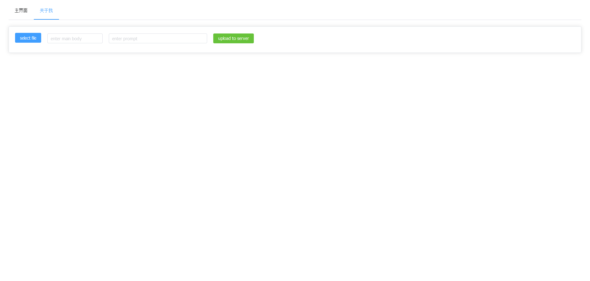

这个项目基于<a href="https://github.com/IDEA-Research/Grounded-Segment-Anything">Grounded-Segment-Anything<a/>做了webui界面，解决了一些网络问题
与原项目gradio_app.py所得到的结果相同，但是设计了ui界面
为了运行这个项目，你需要进行如下步骤

Install requirements package:
```python
pip install -r requirements.txt
```
Install Segment Anything:
```python
python -m pip install -e segment_anything
```
Install Grounding DINO:
```python
python -m pip install -e GroundingDINO
```
Install diffusers:
```python
pip install --upgrade diffusers[torch]
```

接下来你就可以运行
```node.js
npm install -s
```
```node.js
npm run dev
```
```python
python gradio_demo_app.py
```

在优化之后你可能会遇到一些网络问题，但是在正常网络环境下均可解决
